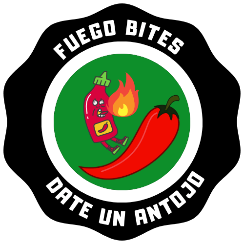

<p align="center"></p>


# Fuego bites

Proyecto administrativo punto de venta para el registro de producto.

## Como instalar el proyecto

Instalar dependecias de php
```
composer install
```

Correr migraciones
```
php artisan migrate --seed
```

Instalar dependencias de npm

```
npm install
```

Correr el proyecto para entorno de desarroll
```
npm run dev
```


## Autor
Daniel Martinez Sierra

